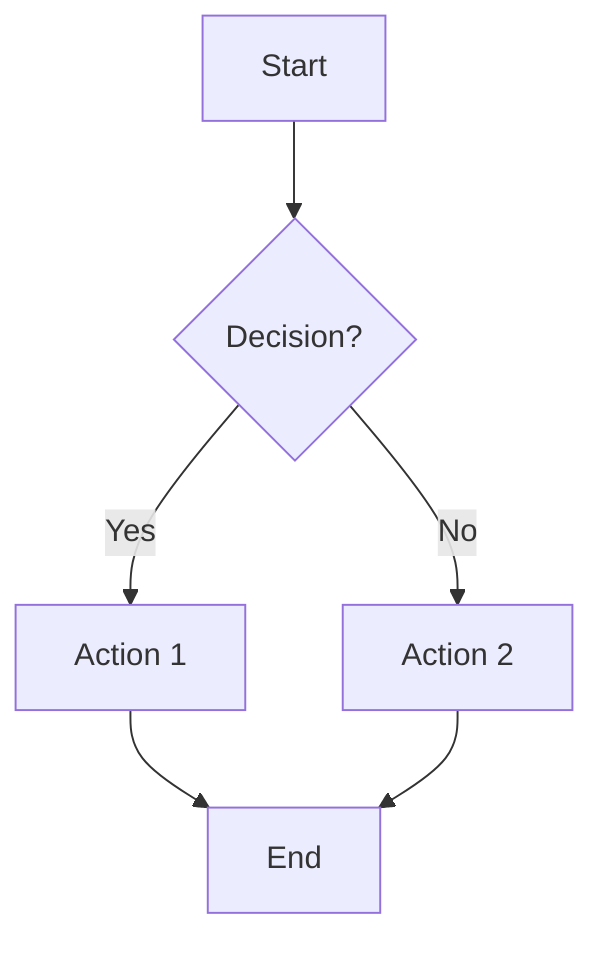
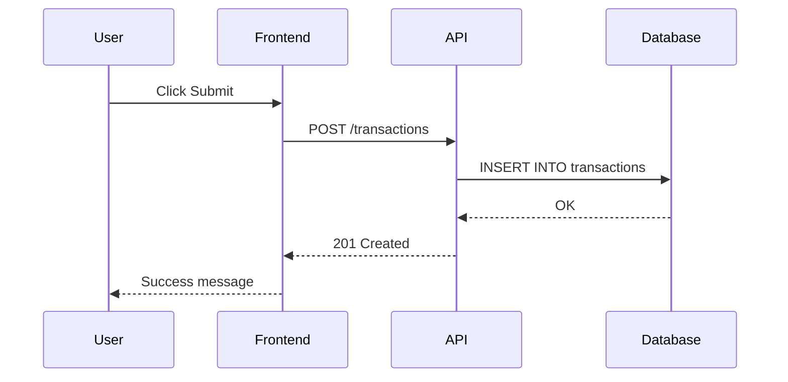
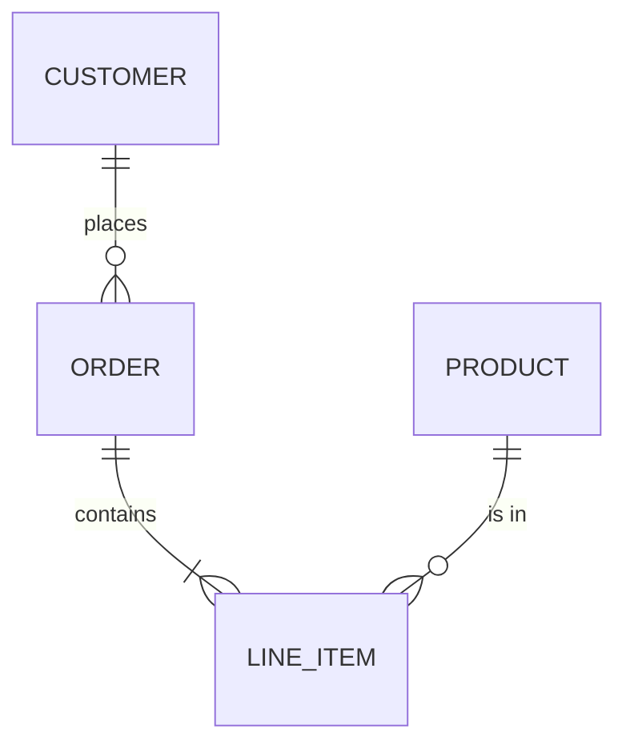
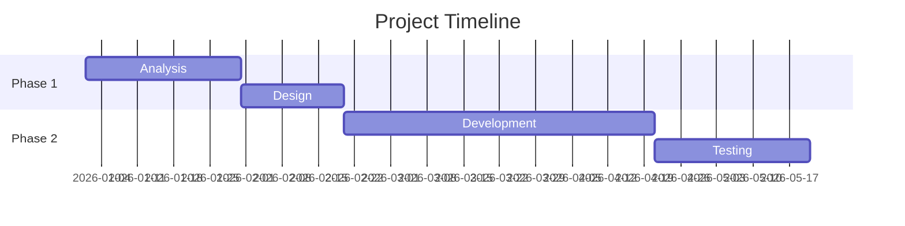
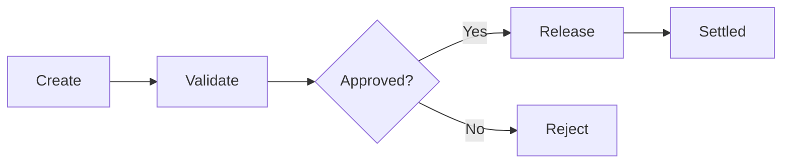

# Markdown Creation Guide

> A step-by-step reference from basic syntax to advanced patterns.
> Each section shows **raw markdown** followed by usage notes.

---

## Section 1 — Headings

```markdown
# Heading 1
## Heading 2
### Heading 3
#### Heading 4
##### Heading 5
###### Heading 6
```

**Rules:**
- Use only one `#` (H1) per document — the document title.
- Use `##` for major sections, `###` for subsections, `####` for details.
- Always leave a blank line before and after a heading.

---

## Section 2 — Paragraphs & Line Breaks

```markdown
### Functional Summary

This module handles the reconciliation of daily cash flows
against expected settlement amounts. It flags discrepancies
exceeding configurable thresholds.

Key concepts include tolerance windows, settlement cycles,
and counterparty matching rules.
```

**Rules:**
- Separate paragraphs with a blank line.
- To force a line break within the same paragraph, end the line with two trailing spaces or use `<br>`.

---

## Section 3 — Text Formatting

```markdown
**bold text**
*italic text*
***bold and italic***
~~strikethrough~~
`inline code`
> blockquote
>> nested blockquote
```

**Rules:**
- Use `**bold**` for emphasis on key terms.
- Use `` `backticks` `` for code references, file names, variable names.
- Avoid underscores (`_italic_`) inside words — prefer asterisks.

---

## Section 4 — Lists

### Unordered Lists

```markdown
- Item A
- Item B
  - Sub-item B1
  - Sub-item B2
    - Sub-sub-item B2a
- Item C
```

### Ordered Lists

```markdown
1. First step
2. Second step
   1. Sub-step 2a
   2. Sub-step 2b
3. Third step
```

### Task Lists (Checkboxes)

```markdown
- [x] Completed task
- [ ] Pending task
- [ ] Another pending task
```

**Rules:**
- Indent nested items with 2 or 4 spaces (be consistent).
- Use `-` for unordered lists (preferred over `*` or `+`).
- Task lists require GitHub-Flavored Markdown (GFM).

---

## Section 5 — Tree Structures (ASCII Art)

Use fenced code blocks with no language tag (or `text`) to display trees.

```markdown
## Screen Architecture

### Component Tree

```
TransactionRoot
├── PageHeader
│   ├── BreadcrumbNav
│   └── ActionToolbar
├── PageBody
│   ├── FilterPanel
│   │   ├── DateRangeFilter
│   │   └── StatusDropdown
│   ├── DataGrid
│   │   ├── ColumnHeaders
│   │   └── RowRenderer
│   └── PaginationBar
└── PageFooter
    └── SummaryStats
```
```

### Box-Drawing Characters Reference

| Character | Name            | Usage          |
|-----------|-----------------|----------------|
| `├──`     | Branch          | Child node     |
| `└──`     | Last branch     | Last child     |
| `│`       | Vertical pipe   | Continuation   |
| `───`     | Horizontal line | Connector      |

**Rules:**
- Use `` ``` `` (fenced code block) to preserve spacing.
- Use `├──` for intermediate children, `└──` for the last child.
- Keep indentation consistent (4 spaces per level).

---

## Section 6 — Directory / File Structures

```markdown
### Project Layout

```
src/
├── components/
│   ├── common/
│   │   ├── Button.vue
│   │   └── Modal.vue
│   └── transactions/
│       ├── TransOverview.vue
│       └── TransDetail.vue
├── stores/
│   └── transactionStore.js
├── routes/
│   └── index.js
└── App.vue
```
```

**Rules:**
- End directory names with `/`.
- Sort directories before files at each level.
- Add a brief comment after the tree if files need explanation.

---

## Section 7 — Code Blocks

### Inline Code

```markdown
Use the `calculateTotal()` function to compute the sum.
```

### Fenced Code Blocks with Syntax Highlighting

````markdown
```javascript
function calculateTotal(items) {
  return items.reduce((sum, item) => sum + item.amount, 0);
}
```
````

````markdown
```sql
SELECT customer_id, SUM(amount)
  FROM transactions
 WHERE status = 'SETTLED'
 GROUP BY customer_id;
```
````

````markdown
```java
public class TransactionService {
    public BigDecimal getTotal(List<Transaction> txns) {
        return txns.stream()
            .map(Transaction::getAmount)
            .reduce(BigDecimal.ZERO, BigDecimal::add);
    }
}
```
````

### Diff Blocks

````markdown
```diff
- const threshold = 100;
+ const threshold = 250;
```
````

**Supported language tags:** `javascript`, `typescript`, `java`, `sql`, `python`, `bash`, `json`, `xml`, `html`, `css`, `vue`, `diff`, `markdown`, `text`, `yaml`, etc.

---

## Section 8 — Links & References

### Inline Links

```markdown
Visit [Google](https://www.google.com) for more information.
See [Section 5](#section-5--tree-structures-ascii-art) above.
```

### Reference-Style Links

```markdown
Read the [contributing guide][contrib] before submitting.

[contrib]: ./CONTRIBUTING.md "Contributing Guidelines"
```

### Auto-Links

```markdown
<https://www.example.com>
<user@example.com>
```

**Rules:**
- Prefer reference-style links when the same URL appears multiple times.
- Use relative paths for links within the same repository.
- Anchor links use lowercase, hyphens replace spaces, special characters are removed.

---

## Section 9 — Images

### Inline Image

```markdown

```

### Image with Title

```markdown

```

### Resized Image (HTML)

```markdown

```

**Rules:**
- Always provide meaningful alt text for accessibility.
- Store images in an `images/` or `assets/` folder.
- Use relative paths, not absolute.

---

## Section 10 — Tables

### Basic Table

```markdown
| Column A | Column B | Column C |
|----------|----------|----------|
| Row 1    | Data     | 100      |
| Row 2    | Data     | 200      |
| Row 3    | Data     | 300      |
```

### Aligned Table

```markdown
| Left-aligned | Center-aligned | Right-aligned |
|:-------------|:--------------:|--------------:|
| Text         |     Text       |          1000 |
| Text         |     Text       |          2000 |
```

**Rules:**
- Use `:---` (left), `:---:` (center), `---:` (right) for alignment.
- Keep columns visually aligned in source for readability.
- For complex tables, prefer HTML `<table>` syntax.

---

## Section 11 — Blockquotes & Callouts

### Simple Blockquote

```markdown
> This is a blockquote used for important notes or citations.
```

### Nested Blockquote

```markdown
> Main point
>
> > Supporting detail or sub-note
```

### GitHub-Style Callouts (Alerts)

```markdown
> [!NOTE]
> Useful information that users should know.

> [!TIP]
> Helpful advice for doing things better or more easily.

> [!IMPORTANT]
> Key information users need to know to achieve their goal.

> [!WARNING]
> Urgent info that needs immediate user attention to avoid problems.

> [!CAUTION]
> Advises about risks or negative outcomes of certain actions.
```

---

## Section 12 — Horizontal Rules (Dividers)

```markdown
---
```

or

```markdown
***
```

or

```markdown
___
```

**Rules:**
- Use `---` consistently (preferred).
- Always have a blank line before and after.
- Use to separate major logical sections.

---

## Section 13 — Escaping Special Characters

```markdown
\* Not italic \*
\# Not a heading
\- Not a list item
\| Not a table pipe
\` Not inline code \`
\\ Literal backslash
```

**Rules:**
- Prefix any Markdown special character with `\` to render it literally.
- Special characters: `\`, `` ` ``, `*`, `_`, `{}`, `[]`, `()`, `#`, `+`, `-`, `.`, `!`, `|`.

---

## Section 14 — HTML in Markdown

### Collapsible / Expandable Sections

```markdown
<details>
<summary>Click to expand — Implementation Details</summary>

This content is hidden by default.

- Detail 1
- Detail 2

```java
// Code is supported inside details blocks
public void process() { }
```

</details>
```

### Centered Text

```markdown
<div align="center">

**Centered Title**


</div>
```

### Colored Badges / Shields

```markdown


```

### Keyboard Keys

```markdown
Press <kbd>Ctrl</kbd> + <kbd>Shift</kbd> + <kbd>P</kbd> to open the command palette.
```

---

## Section 15 — Footnotes

```markdown
This statement needs clarification[^1].

Another claim with a source[^reference].

[^1]: Explanation or citation for the first footnote.
[^reference]: Full reference details here.
```

**Rules:**
- Footnote definitions can be placed anywhere; they render at the bottom.
- Supported in GitHub-Flavored Markdown.

---

## Section 16 — Definition Lists (Extended Markdown)

```markdown
Term 1
: Definition of term 1.

Term 2
: Definition of term 2.
: Alternative definition of term 2.
```

**Note:** Not supported in all renderers. Works in PHP Markdown Extra, Pandoc, some VS Code extensions.

---

## Section 17 — Emoji

### Shortcodes (GitHub)

```markdown
:white_check_mark: Passed
:x: Failed
:warning: Warning
:rocket: Deployed
:memo: Documentation
:bug: Bug fix
```

### Unicode Emoji

```markdown
✅ Passed
❌ Failed
⚠️ Warning
🚀 Deployed
```

---

## Section 18 — Mathematical Expressions (LaTeX / KaTeX)

### Inline Math

```markdown
The formula is $E = mc^2$ where $m$ is mass.
```

### Block Math

```markdown
$$
\sum_{i=1}^{n} x_i = x_1 + x_2 + \cdots + x_n
$$
```

**Rules:**
- Use `$...$` for inline math, `$$...$$` for display math.
- Supported in GitHub (since 2022), VS Code, Jupyter, and most modern renderers.

---

## Section 19 — Mermaid Diagrams

### Flowchart

````markdown

````

### Sequence Diagram

````markdown

````

### Entity Relationship Diagram

````markdown

````

### Gantt Chart

````markdown

````

**Rules:**
- Mermaid is natively supported on GitHub and in VS Code (with extensions).
- Keep diagrams simple — complex ones become unreadable.

---

## Section 20 — YAML Front Matter

```markdown
---
title: "Document Title"
author: "Author Name"
date: 2026-03-25
version: 1.0.0
tags: [markdown, guide, reference]
---

# Document content starts here
```

**Rules:**
- Must be the very first thing in the file (no blank lines before).
- Delimited by `---` on both sides.
- Used by static site generators (Jekyll, Hugo), documentation tools, and some VS Code extensions.

---

## Section 21 — Table of Contents (Manual)

```markdown
## Table of Contents

- [Introduction](#introduction)
- [Installation](#installation)
  - [Prerequisites](#prerequisites)
  - [Setup](#setup)
- [Usage](#usage)
- [API Reference](#api-reference)
- [Contributing](#contributing)
- [License](#license)
```

**Anchor rules:**
- Lowercase all letters.
- Replace spaces with hyphens (`-`).
- Remove special characters except hyphens.
- Example: `## Section 21 — Table of Contents` → `#section-21--table-of-contents`

---

## Section 22 — Combining Patterns (Full Document Template)

````markdown
---
title: "Feature Specification"
version: 1.0.0
date: 2026-03-25
---

# Feature Name

> [!NOTE]
> This document follows the standard specification template.

## Table of Contents

- [Functional Summary](#functional-summary)
- [Screen Architecture](#screen-architecture)
- [Data Model](#data-model)
- [API Endpoints](#api-endpoints)
- [Business Rules](#business-rules)

---

## Functional Summary

This module manages the lifecycle of settlement instructions.
It enables operators to create, validate, and release payments
across multiple clearing systems.

Key concepts include netting groups, value-date scheduling,
and multi-currency support.

---

## Screen Architecture

### Component Tree

```
TransSettlement
├── PageHeader
│   ├── BreadcrumbNav
│   └── ActionBar
│       ├── BtnCreate
│       ├── BtnValidate
│       └── BtnRelease
├── FilterPanel
│   ├── DateRange
│   ├── CurrencySelect
│   └── StatusFilter
└── DataGrid
    ├── ColumnDefs
    └── RowActions
```

---

## Data Model

| Column           | Type         | Nullable | Description              |
|:-----------------|:-------------|:--------:|:-------------------------|
| settlement_id    | NUMBER(12)   |    No    | Primary key              |
| counterparty_id  | NUMBER(12)   |    No    | FK to counterparty table |
| amount           | NUMBER(18,2) |    No    | Settlement amount        |
| currency_code    | CHAR(3)      |    No    | ISO 4217 currency code   |
| value_date       | DATE         |    No    | Settlement value date    |
| status           | VARCHAR2(20) |    No    | PENDING / VALIDATED / RELEASED |

---

## API Endpoints

### Create Settlement

```
POST /api/v1/settlements
```

**Request Body:**

```json
{
  "counterpartyId": 12345,
  "amount": 50000.00,
  "currencyCode": "EUR",
  "valueDate": "2026-03-30"
}
```

**Response:** `201 Created`

---

## Business Rules

1. **BR-001** — Settlement amount must be positive.
2. **BR-002** — Value date must be a business day.
3. **BR-003** — Currency must be in the allowed list.

- [x] BR-001 implemented
- [x] BR-002 implemented
- [ ] BR-003 pending

---

<details>
<summary>Appendix — Settlement Flow Diagram</summary>



</details>
````

---

## Quick Reference Cheat Sheet

| Element              | Syntax                                        |
|:---------------------|:----------------------------------------------|
| Bold                 | `**text**`                                    |
| Italic               | `*text*`                                      |
| Strikethrough        | `~~text~~`                                    |
| Inline code          | `` `code` ``                                  |
| Code block           | ```` ```lang ... ``` ````                     |
| Link                 | `[text](url)`                                 |
| Image                | ``                                |
| Heading              | `# H1` … `###### H6`                         |
| Unordered list       | `- item`                                      |
| Ordered list         | `1. item`                                     |
| Task list            | `- [x] done` / `- [ ] todo`                  |
| Table                | `\| col \| col \|`                            |
| Blockquote           | `> text`                                      |
| Callout              | `> [!NOTE]`                                   |
| Horizontal rule      | `---`                                         |
| Footnote             | `text[^1]` + `[^1]: note`                    |
| Collapsed section    | `<details><summary>…</summary>…</details>`   |
| Mermaid diagram      | ```` ```mermaid … ``` ````                    |
| Math (inline)        | `$formula$`                                   |
| Math (block)         | `$$formula$$`                                 |
| Escape               | `\*`, `\#`, `\|`, etc.                        |
| Keyboard key         | `<kbd>Ctrl</kbd>`                             |
| YAML front matter    | `---` … `---` at file start                  |
